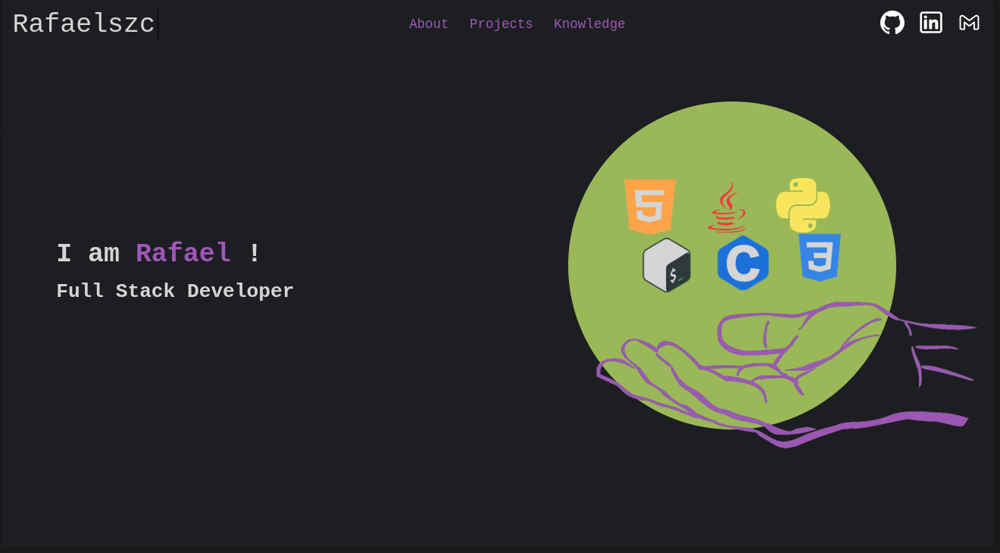

# Portifolio

Welcome to my portfolio! I'm thrilled to be working on this project, where I get to show off some of my front-end skills! Enjoy!

## Summary
- [Portifolio](#portifolio)
  - [Summary](#summary)
  - [Preview](#preview)
  - [TODO](#todo)
  - [Usage](#usage)
  - [Contact-me](#contact-me)

## Preview



<h3 align="center"><a href="https://rafaelszc.github.io/Portifolio/">Acess here!</a></h3>

Topics of page:
+ Home Page
+ About Me
+ Projects
+ Knowledge (TODO)

## TODO
This project isn't finished. There are ideas that need to be finalized.

- [ ] Mobile Responsiveness
- [ ] Knowledge Section

## Usage
1. Copy and paste in bash:

```bash
git clone https://github.com/Rafaelszc/portifolio.git
```

2. Open `index.html`


## Contact-me

<div class="contact-images" align=center>
    <a href="https://github.com/Rafaelszc"></a>
    <a href="mailto:rafaelbjj84@gmail.com"></a>
    <a href="https://www.linkedin.com/in/rafael-souza-5461762b8"></a>
</div>