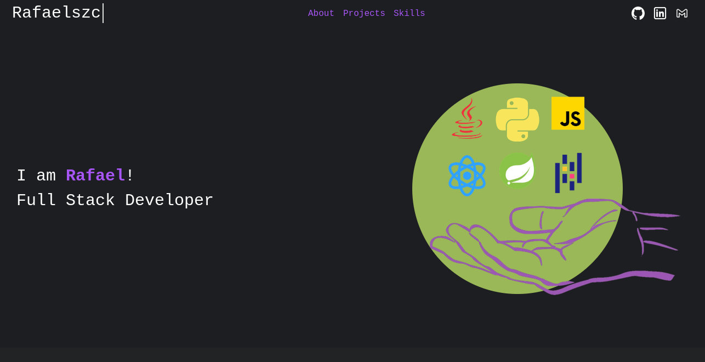
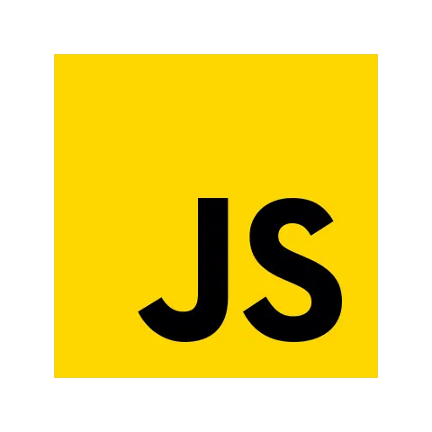
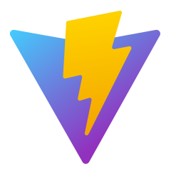

# Portfolio

Welcome to my Portfolio! Here I will briefly present my career as a full stack developer and update it over time. Enjoy!

## Summary
- [Portfolio](#portfolio)
  - [Summary](#summary)
  - [Preview](#preview)
    - [Topics of page:](#topics-of-page)
  - [Technologies Used](#technologies-used)
  - [TODO](#todo)
  - [Usage](#usage)
  - [Contact-me](#contact-me)

## Preview



<h3 align="center"><a href="https://rafaelszc.github.io/Portifolio/" target="_blank">Acess here!</a></h3>

This is a portfolio built with Vite, React, and Tailwind CSS to showcase the main projects I have published on GitHub. I hope to update the project, making it cleaner and more presentable as I learn new technologies.

### Topics of page:
+ Main section
+ About Me
+ Projects
+ Skills

## Technologies Used

<div align="center">
  <a href="https://developer.mozilla.org/pt-BR/docs/Web/JavaScript" target="_blank"></img></a>
  <a href="https://vite.dev/" target="blank"></a>
  <a href="https://react.dev/" target="_blank"></img></a>
  <a href="https://tailwindcss.com/" target="_blank"></a>
</div>


## TODO
This project isn't finished. There are ideas that need to be finalized.

- [ ] Mobile Responsiveness

## Usage
1. Copy and paste in bash:

```bash
git clone https://github.com/Rafaelszc/Portifolio.git

cd Portifolio/
```

2. Install dependencies

```bash
npm install
```

3. Run project

```bash
npm run dev
```


## Contact-me

<div class="contact-images" align=center>
    <a href="https://github.com/Rafaelszc"></a>
    <a href="mailto:rafaelbjj84@gmail.com"></a>
    <a href="https://www.linkedin.com/in/rafael-souza-5461762b8"></a>
</div>